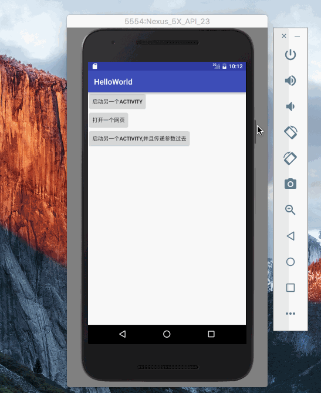

# 项目说明
本项目用于个人学习Android的demo




最新的demo可以扫下面的二维码安装测试包


# 进度

## 1. 原理概念
1. 环境搭建,Android Studio的使用
2. helloWorld项目的初始化
3. 理解Activity和layout的关系, 学习Activity之间的跳转以及Activity跳转到网页 
(疑问:对于hybrid App,是不是每一个html页面都单独占据一个Activity?这样页面之间的跳转就相当于是Activity的跳转了)
4. 理解Activity的生命周期: onCreate,onStart,onResume,(Running),onPause,onStop,onRestart/onDestroy, 在monitor console中查看输出
流转关系查看这里 file:///Users/youngwind/Library/Android/sdk/docs/guide/components/activities.html
5. 文档查看 open ~/Library/Android/sdk/docs/index.html
6. Activity之间跳转的时候各个Activity的生命周期是如何转换的
(疑问:在Activity A打开网页,观察到Activity A会进入onPause和onStop周期)
7. Activity A打开Activity B,并且同时给Activity B传参数(复杂数据结构参数bundle)
8. Activity A打开Activity B, Activity B返回数据给Activity A (startActivityForResult)
9. 任务栈task与Activity的关系:一个task其实是一个Activity的集合栈,在一般方式下前进后退就相当于入栈出栈.
(疑问:这个就跟hybrid很像的,我觉得hybrid里面页面的跳转绝壁是通过这种方式,这点有待验证)
(PS:对于task和activity的调度关系,有一些特殊情况,具体可以参考这里:http://blog.csdn.net/zhangjg_blog/article/details/10923643)
10. Intent的详解  http://www.cnblogs.com/smyhvae/p/3959204.html (此处有很多实例,有待抄袭)
11. Context的理解 http://www.cnblogs.com/smyhvae/p/3959204.html (此处较为高级,目前用不到,先不予理会)
12. service的理解 http://blog.csdn.net/u011067360/article/details/24523491  
(比如底层发送网络请求应该就是这货,这里需要深入研究)
(感悟:安卓开发与前端开发很不一样,前端开发从来不会越过浏览器去跟系统级服务打交道)
13. AIDL 进程之间相互访问(暂时没用,不深入)

## 2. UI部分
1. 基本布局方式(等分,自适应),layout:linearLayout, RelativeLayout, frameLayout等等
2. 直接用代码操作view,添加删除元素,就像js直接操作DOM一样
3. 学习使用RecyclerView(代替listView列表,非常重要)
4. 学习使用基本UI控件(特别是ImageView,ProgressBar,AlertDialog,ProgressDialog)附带定时器的使用
5. 学习使用通知栏


## 3. 网络通信
1. 如何用原生的asyncTask和connection发起http get请求?(很重要)
两种方式:HttpURLConnection vs DefaultHttpClient,区别与联系
http://blog.csdn.net/iispring/article/details/51474529
2. 学习如何使用第三方网络库请求网络请求(Android-async-http vs Volley)
3. 学习如何解析json数据(原生JSONObject和谷歌开源的GSON)


## 4. WebView
1. 学习使用webview装载一个网页
2. 启用javascript
3. 学习用java弹出系统提示消息:toast
4. 学习使用addJavascriptInterface建立jsBridge
5. 学习使用自定义URL建立jsBridge
6. 学习使用jsAlert建立jsBridge

## 5. 广播机制
1. 学习动态接受系统广播(以网络变化为例)

## 6. 存储
1. 学习对文件进行存储和读取
2. 学习使用SQLite数据库(增删改查)
3. 学习使用sharedPreferences,实现记住登录密码功能

## 7. 服务
1. 使用子进程进行耗时操作
2. 在子进程中更改UI

## 8. 其他
1. gradle的使用 http://stormzhang.com/devtools/2014/12/18/android-studio-tutorial4/
2. apk打包 
```
./gradlew -v
./gradlew clean
./gradlew build
```
3. 安装电脑上apk包 http://www.dbform.com/html/2012/1807.html  platform-tools路径: /Users/youngwind/Library/Android/sdk/platform-tools/
4. 学习使用adb shell 进入手机系统,使用su和cat查看手机文件 
http://www.eoeandroid.com/thread-310228-1-1.html 
http://zmywly8866.github.io/2015/01/24/all-adb-command.html